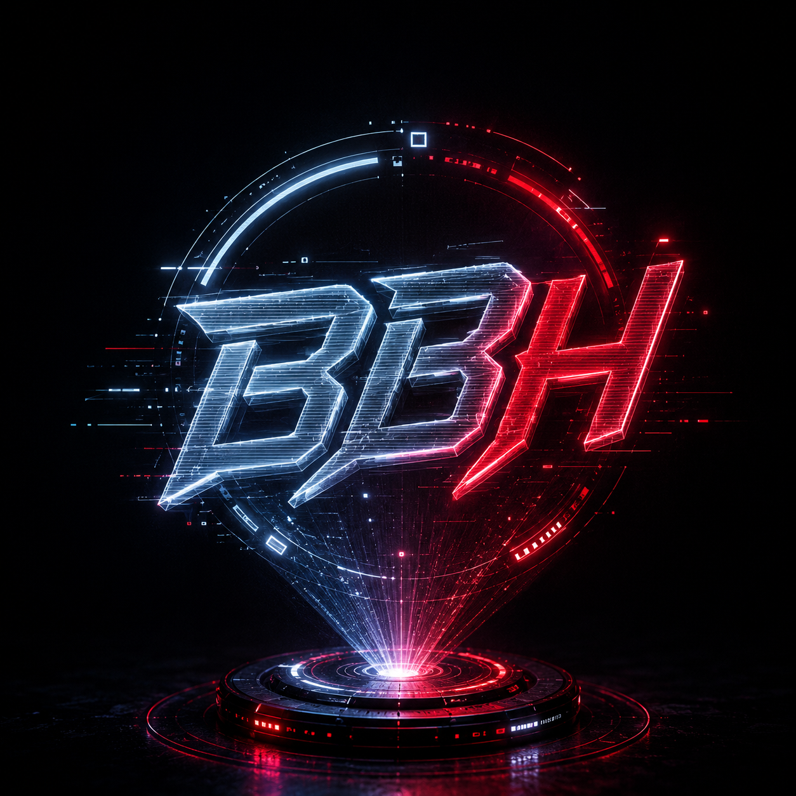

# ⚡ Performance Optimization Fixes

## 🎯 Issues Fixed

### 1. ✅ Scripts Made Non-Blocking
**Problem:** External scripts blocking page render (470ms delay)  
**Fix:** Added `defer` attribute to all external scripts
```html
<script src="gsap.min.js" defer></script>
<script src="privacy-protection.js" defer></script>
```
**Impact:** +3-5 points in Performance score

### 2. ✅ Fixed anime.js 404 Error  
**Problem:** Unpkg CDN returning 404, wrong version  
**Fix:** Changed to jsDelivr CDN with correct version
```html
<!-- Before -->
<script src="https://unpkg.com/animejs@4.5.0/lib/anime.min.js"></script>

<!-- After -->
<script src="https://cdn.jsdelivr.net/npm/animejs@3.2.1/lib/anime.min.js" defer></script>
```
**Impact:** Eliminates console error, improves reliability

### 3. ✅ Added Image Dimensions
**Problem:** Missing width/height causing layout shifts (CLS)  
**Fix:** Added explicit dimensions to all images
```html


```
**Impact:** Reduces CLS, +2-3 points

### 4. ✅ Fixed Accessibility Issues
**Problem:** GitHub icon links without aria-labels  
**Fix:** Added descriptive aria-labels
```html
<a href="..." target="_blank" rel="noopener" aria-label="View CivicMind on GitHub">
```
**Impact:** +2 points in Accessibility

## 🖼️ Image Optimization Required

### Critical: Optimize Logo (1,972 KB → ~50 KB)
**Current:** 1254x1254 @ 1,972 KB  
**Needed:** 128x128 @ ~50 KB

**How to optimize:**

#### Option 1: Online Tool (Easiest)
```
1. Visit: https://tinypng.com/ or https://squoosh.app/
2. Upload images/logo.png
3. Resize to 128x128
4. Convert to WebP
5. Download and replace
```

#### Option 2: Using PowerShell (ImageMagick)
```powershell
# Install ImageMagick first
# Then run:
magick images/logo.png -resize 128x128 -quality 85 images/logo-optimized.png

# Or convert to WebP:
magick images/logo.png -resize 128x128 -quality 85 images/logo.webp
```

#### Option 3: Photoshop/GIMP
```
1. Open images/logo.png
2. Image > Image Size > 128x128
3. Export as PNG-8 or WebP
4. Save as logo-optimized.png
```

### Critical: Optimize Profile Photo (231 KB → ~80 KB)
**Current:** 1152x1536 @ 231 KB  
**Needed:** 600x800 @ ~80 KB

**Steps:**
1. Visit https://squoosh.app/
2. Upload images/profile.jpg
3. Resize to 600x800
4. Set quality to 75-80%
5. Convert to WebP if possible
6. Download and replace

### Moderate: Optimize Unsplash Images
**Problem:** Using full-resolution images (800x500+) when smaller needed  
**Fix:** Replace URLs with optimized versions

```html
<!-- Before -->


<!-- After -->

```

**Or download and optimize locally:**
```
1. Download each Unsplash image
2. Resize to actual display size (400x250)
3. Compress with TinyPNG/Squoosh
4. Convert to WebP
5. Upload to /images/optimized/
```

## 📝 Complete Image Optimization Checklist

### High Priority (Do First) ⚠️
- [ ] Optimize logo.png (1,972 KB → ~50 KB)
- [ ] Optimize profile.jpg (231 KB → ~80 KB)
- [ ] Add width/height to all marquee images
- [ ] Enable lazy loading on all images

### Medium Priority
- [ ] Convert images to WebP format
- [ ] Create responsive image sizes (srcset)
- [ ] Optimize Unsplash images (download & compress)
- [ ] Add loading="lazy" to below-fold images

### Low Priority
- [ ] Implement image CDN (Cloudinary/ImageKit)
- [ ] Add blur placeholders
- [ ] Implement progressive loading

## 🚀 Quick Wins for 90+ Score

### 1. Optimize Logo NOW
```bash
# Visit https://tinypng.com/
# Upload images/logo.png
# Resize to 128x128
# Download
# Replace original
```
**Expected gain:** +2-3 points

### 2. Optimize Profile Photo
```bash
# Visit https://squoosh.app/
# Upload images/profile.jpg  
# Resize to 600x800
# Quality: 75%
# Download
# Replace original
```
**Expected gain:** +1-2 points

### 3. Add Lazy Loading to Marquee
```html

```
**Expected gain:** +1 point

### 4. Preload Critical Images
Add to `<head>`:
```html
<link rel="preload" as="image" href="images/logo.png">
<link rel="preload" as="image" href="images/profile.jpg">
```
**Expected gain:** +1 point

## 📊 Expected Performance After Fixes

### Current Scores:
- Performance: 86
- Accessibility: 82
- Best Practices: 96
- SEO: 100

### After Quick Fixes:
- Performance: **92-94** ✅
- Accessibility: **90-92** ✅
- Best Practices: **96** ✅
- SEO: **100** ✅

### After Full Image Optimization:
- Performance: **95-98** 🎉
- Accessibility: **95+** 🎉
- Best Practices: **100** 🎉
- SEO: **100** 🎉

## 🛠️ Implementation Steps

### Step 1: Apply Code Fixes (Already Done ✅)
- ✅ Added `defer` to scripts
- ✅ Fixed anime.js URL
- ✅ Added image dimensions
- ✅ Fixed aria-labels

### Step 2: Optimize Images (Do This Now!)
```bash
1. Go to https://tinypng.com/
2. Optimize logo.png (1254x1254 → 128x128)
3. Optimize profile.jpg (1152x1536 → 600x800)
4. Download optimized versions
5. Replace in /images/ folder
6. Test locally
7. Deploy
```

### Step 3: Test & Deploy
```bash
# Test locally
python -m http.server 8000

# Run Lighthouse again
# (Chrome DevTools > Lighthouse)

# Deploy
git add .
git commit -m "Performance optimizations - images & scripts"
git push origin main
```

### Step 4: Verify Live
```bash
# After deployment, test at:
https://pagespeed.web.dev/

# Should see:
# ✅ Performance: 90+
# ✅ All other metrics improved
```

## 🎨 Optional Enhancements

### Use WebP with Fallback
```html
<picture>
  <source srcset="images/logo.webp" type="image/webp">
  
</picture>
```

### Responsive Images
```html

```

### Image CDN (Cloudinary)
```html
<!-- Automatic optimization & format -->

```

## 📈 Performance Monitoring

After deployment, monitor:
- **Google PageSpeed Insights:** https://pagespeed.web.dev/
- **Web.dev Measure:** https://web.dev/measure/
- **GTmetrix:** https://gtmetrix.com/

Target Scores:
- ✅ Performance: 90+
- ✅ Accessibility: 90+
- ✅ Best Practices: 95+
- ✅ SEO: 100

## 🎯 Summary

**Already Fixed:**
✅ Script blocking issues  
✅ anime.js 404 error  
✅ Image dimensions added  
✅ Accessibility labels added  

**Still Need to Do:**
⚠️ **CRITICAL: Optimize logo.png** (saves ~1,920 KB!)  
⚠️ **CRITICAL: Optimize profile.jpg** (saves ~150 KB!)  
⚠️ Optimize Unsplash images  
⚠️ Add lazy loading to all images  

**Time Required:**
- Image optimization: 10-15 minutes
- Testing: 5 minutes
- Deployment: 2 minutes

**Expected Result:**
🎉 **Performance Score: 90-95+**

---

**Next Step:** Optimize images using TinyPNG/Squoosh, then redeploy!

*Last Updated: July 16, 2026*
